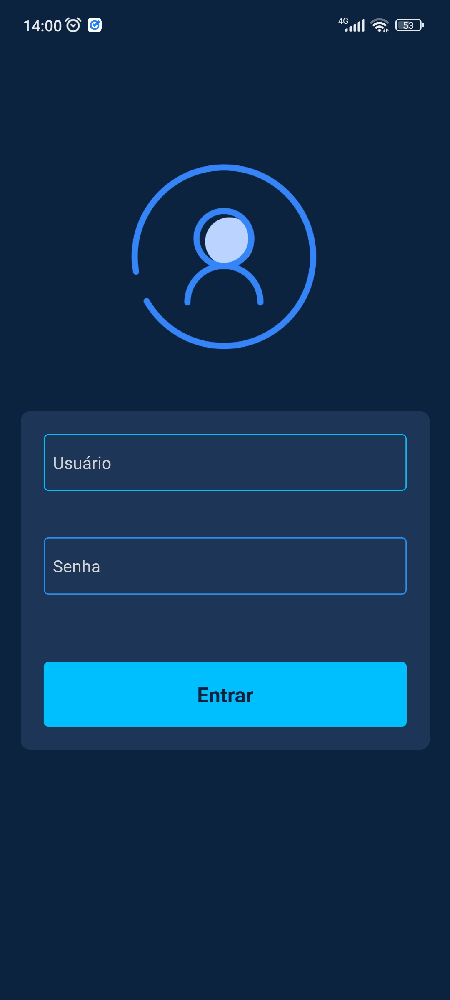

<h4 align="center">
Duobox Challenge
</h4>

<h4 align="center">
    <p align="center">
      <a href="#-about">About</a>&nbsp;&nbsp;&nbsp;|&nbsp;&nbsp;&nbsp;
      <a href="#-technologies">Technologies</a>&nbsp;&nbsp;&nbsp;|&nbsp;&nbsp;&nbsp;
      <a href="#-how-to-run-the-project">Run</a>&nbsp;&nbsp;&nbsp;|&nbsp;&nbsp;&nbsp;
      <a href="#-info">Info</a>&nbsp;&nbsp;&nbsp;|&nbsp;&nbsp;&nbsp;
      <a href="#-license">License</a>
  </p>
</h4>

<h1 align="center">
    
</h1>

## 🔖 About

Neste projeto, foi desenvolvido um aplicativo em React Native para a empresa fictícia, que permite que o usuário digite um número de CPF/CNPJ ou um endereço de e-mail e, após digitar, mostre uma lista com os clientes encontrados para o documento/e-mail informado. O usuário pode escolher um item para visualizar mais informações sobre aquele serviço. Além disso, o usuário pode visualizar a lista de boletos referentes ao serviço, fazer a baixa do boleto em aberto ou o cancelamento, e enviar o boleto por e-mail.

O aplicativo se comunica com uma API que utiliza autenticação Basic Auth.
Foram utilizados os seguintes endpoints para a integração com a API:

- /clientes/index
- /clientes_internet/buscainfo
- /clientes_cobrancas/pesquisa
- /clientes_cobrancas/liquidar
- /clientes_cobrancas/cancelar
- /boletos/enviar_email

Este projeto foi desenvolvido como parte de um teste prático para a vaga de programador React Native na empresa Duobox, e foi disponibilizado neste repositório após a conclusão.

- [Detalhes](docs/ABOUT.md)
- [Screens](docs/SCREENSHOTS.md)

## 🚀 Technologies

- [ReactNative](https://pt-br.reactjs.org/)
- [Axios](https://github.com/axios/axios)
- [ReactHookForm](https://react-hook-form.com/)
- [Zod](https://github.com/colinhacks/zod)
- [ReactNavigation](https://reactnavigation.org/)
- [StyledComponents](https://styled-components.com/)

## 🏁 How to run the project

#### Clone the repository

```bash
git clone https://github.com/rafinhaa/duobox-challenge
cd duobox-challenge
```

#### Install dependencies

```bash
yarn install
cd ios && pod install && cd ..
```

#### Start android

```bash
yarn start
```

## ℹ️ Info

## 📄 Changelog

## 📝 License

[MIT](LICENSE.txt)

**Free Software, Hell Yeah!**
